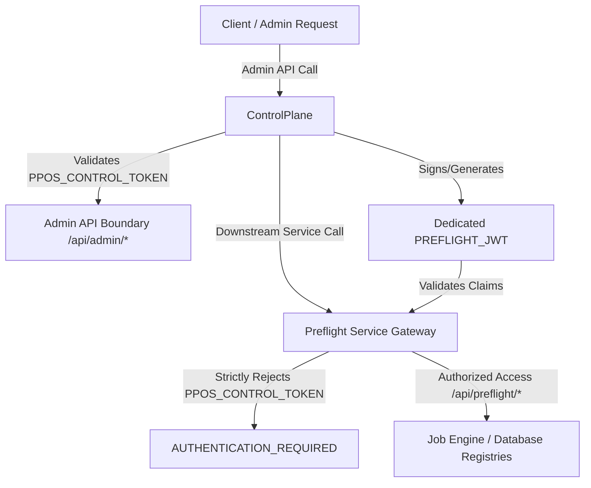

# Preflight Auth Contract

The **Preflight Auth Contract** documents the security architecture, token boundaries, cryptographical claims, and inter-service authentication protocols utilized between PrintPrice OS administrative platforms and processing microservices. 

Adhering to these strict token separation policies prevents security token leakage, secures upstream gateways, and guarantees isolated data transactions across all systems.

This secure authentication design is governed by the platform's core operational promise:

> **Engine produces truth. Service preserves truth. Worker executes and persists truth. BFF displays truth. ControlPlane governs truth.**

---

## 1. Auth Separation

To prevent privilege escalation and credential leakage, the platform enforces strict structural separation between two distinct authorization entities:



### `PPOS_CONTROL_TOKEN`
*   **Purpose**: Authorizes global administrative control actions inside the **ControlPlane** application context.
*   **Application Scope**: Restricted exclusively to ControlPlane admin endpoints matching `/api/admin/*`.
*   **Security Boundary**: **Must never** be forwarded to the Preflight Service or BFF/App as an upstream Authorization bearer header. Downstream gateways will reject this token as invalid.

### `PREFLIGHT_JWT`
*   **Purpose**: Authorizes discrete preflight jobs, policy retrievals, and diagnostic requests within processing services.
*   **Application Scope**: Signed by the central auth authority, this token must be passed as an `Authorization: Bearer <JWT>` header. It is strictly required for the following endpoints:
    *   `/api/preflight/jobs` (Ingest job creation)
    *   `/api/preflight/jobs/:jobId` (Specific diagnostic inquiries)
    *   `/api/preflight/jobs/policies` (Ingestion rules gating)
    *   `/api/v2/jobs` (Job creation in the v2 API engine)
    *   `/api/v2/jobs/:jobId` (Specific job retrieval in the v2 API engine)

---

## 2. Required JWT Claims

To pass downstream gateway validation, the `PREFLIGHT_JWT` token must contain the following cryptographic claims inside its signed payload:

*   **`issuer`** (`iss`): `https://auth.printprice.pro`
*   **`audience`** (`aud`): `ppos:control`
*   **`tenantId`**: `ppos-production-worker` (or the active client tenant ID mapped to the transaction)
*   **`scopes`** (`scp`): The token must carry the specific scopes required to complete the operation:
    *   `preflight:read`: View preflight job statuses and metrics.
    *   `preflight:write`: Create or update preflight analysis records.
    *   `preflight:analyze`: Invoke parsing binaries on physical assets.
    *   `jobs:read`: Read general job tracking tables.
    *   `jobs:write`: Persist repaired document telemetry.

---

## 3. Production Incident & Resolution

During the Phase 35.5 validation milestone, a critical integration bug was identified and resolved:

### The Incident
*   **Symptom**: The ControlPlane admin synchronization panel began throwing persistent connection errors. The Preflight Service rejected incoming synchronization payloads, returning `401 Unauthorized` with error messages: `AUTHENTICATION_REQUIRED` or `jwt malformed`.
*   **Root Cause**: When executing the synchronization cycle, the ControlPlane was passing its own incoming `Authorization` header (`PPOS_CONTROL_TOKEN`) downstream directly to the Preflight Service API. Because the Preflight Service gateway was configured to strictly validate `PREFLIGHT_JWT` signatures and claims, it rejected the administrative token, halting data synchronization.

### The Resolution
1.  **Header Sanitization**: Refactored the `PreflightContractGateway` inside the ControlPlane, ensuring that the incoming client `req.headers.authorization` header is stripped and **never** forwarded.
2.  **Dedicated JWT Generation**: Reconfigured the synchronization router to generate a dedicated inter-service `PREFLIGHT_JWT` signed with the appropriate `ppos-production-worker` tenant ID and scope parameters.
3.  **Successful Verification**: The newly signed JWT successfully validated upstream policies, permitting job hydration and administrative sweeps to execute without authentication warnings.

---

## 4. Operational Rule

:::important
**Token Isolation Principle**: Never forward a ControlPlane admin Authorization token directly to the Preflight Service or BFF/App. All downstream API calls must utilize an explicitly signed, short-lived `PREFLIGHT_JWT` bearing the exact tenant scope of the execution context.
:::

---

## 5. Validation Commands

The following `curl` command templates demonstrate how to validate token boundaries across the various network gateways. 

*(Note: Real credentials are masked using variables. Replace variables with live environment values in secure shells.)*

### A. Validate BFF/App Policies Ingestion Gate
Verify that the Preflight BFF successfully reads preflight validation policies using a signed JWT:
```bash
curl -X GET "https://bff.printprice.pro/api/preflight/jobs/policies" \
  -H "Authorization: Bearer ${PREFLIGHT_JWT}" \
  -H "X-Tenant-Id: ${ACTIVE_TENANT_ID}" \
  -H "Content-Type: application/json"
```

### B. Validate Upstream Preflight Service API
Create a new analysis job by submitting raw parameters to the core Preflight Service:
```bash
curl -X POST "https://service.printprice.pro/api/v2/jobs" \
  -H "Authorization: Bearer ${PREFLIGHT_JWT}" \
  -H "Content-Type: application/json" \
  -d '{
    "jobId": "job_manual_verify_101",
    "targetFile": "s3://ppos-storage/incoming/validate.pdf"
  }'
```

### C. Validate ControlPlane Administrative Gate
Verify administrative operations on the ControlPlane panel using the separate control token:
```bash
curl -X GET "https://control.printprice.pro/api/admin/tenants" \
  -H "Authorization: Bearer ${PPOS_CONTROL_TOKEN}" \
  -H "Content-Type: application/json"
```

### D. Validate Synchronization Operations
Verify the inter-service sync channel directly from ControlPlane using a signed backend JWT:
```bash
curl -X POST "https://control.printprice.pro/api/admin/sync/jobs" \
  -H "Authorization: Bearer ${PPOS_CONTROL_TOKEN}" \
  -H "X-Upstream-Token: Bearer ${PREFLIGHT_JWT}" \
  -H "Content-Type: application/json"
```
