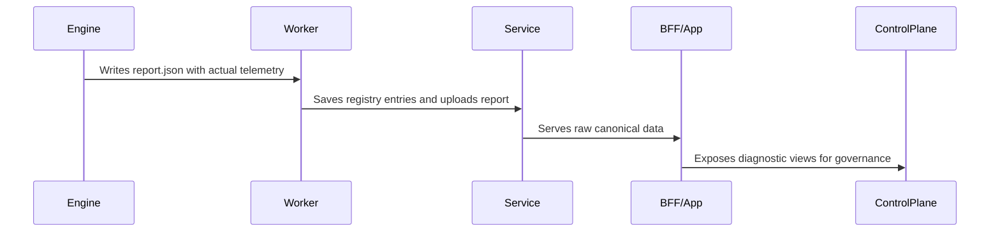

# Preflight Diagnostic Contract — Phase 10/35 Production Validation

This document establishes the formal specifications for the **Preflight Diagnostic Contract** within PrintPrice OS. 

This contract defines the structured telemetry exchange and validation patterns governing our distributed printing pipeline, ensuring all analysis findings and automated repair metadata are propagated consistently without loss of data integrity.

This decoupled architecture operates on a core platform promise:

> **Engine produces truth. Service preserves truth. Worker executes and persists truth. BFF displays truth. ControlPlane governs truth.**

---

## 1. Executive Summary

The **Phase 10/35 Preflight Diagnostic Contract** is **production validated**. 

Through extensive multi-repository verification, the platform has successfully integrated a robust diagnostic pipeline spanning parsing engines, API gateways, worker queues, user interfaces, and administrative portals. 

All diagnostic exchanges are governed by strict schema envelopes, ensuring absolute consistency, fault isolation, and deterministic error handling.

---

## 2. Problem Solved

Prior to the stabilization of this contract, the platform suffered from critical operational vulnerabilities across its distributed layers:

*   **Incorrect Failure Conversions**: When individual parsing utilities or auxiliary CLI dependencies were missing from worker containers, the system would default to crashing the job. This incorrectly converted recoverable `degraded` or `partial` analysis runs into fatal `FAILED_RUNTIME_ENVIRONMENT` statuses.
*   **Loss of Findings**: Diagnostic findings (such as missing bleeds or incorrect page counts) were frequently stripped or lost when passing payloads through multiple database serialization and REST transfer layers.
*   **Metadata Decay**: Repaired document files and automated quality policies would lose vital execution parameters, making it impossible to audit which specific fixes had been executed on physical PDF assets.
*   **Incomplete Governance**: The ControlPlane had no mechanism to verify if an analysis was complete, leading to situations where administrative decisions were governed by incomplete or missing telemetry.

---

## 3. The Canonical Contract

To solve these issues, the Preflight Diagnostic Contract establishes a set of non-negotiable design invariants:

1.  **Tool Availability Decoupling**: A missing local tool or sub-dependency is an operational watchpoint, **not** an environment runtime failure. The parsing process must degrade gracefully.
2.  **Valid Terminal States**: `DEGRADED` and `PARTIAL` are valid, stable terminal diagnostic states. They represent completed analyses that succeeded under restricted conditions.
3.  **Positive Ingestion Results**: Finding issues in a PDF is the target function of preflight. A successful extraction that finds errors (resulting in status `COMPLETED_WITH_FINDINGS`) is a successful transport, **never** a system failure.
4.  **Preservation of Progress**: Even when operating in a degraded mode, `realExtraction` must remain `true` if actual file parsing occurred. 
5.  **Strict Fallback Semantics**: The flag `fallbackUsed` must exclusively be set when actual mock extraction occurred or when the system could not perform any real file inspection.
6.  **No Fabricated Diagnostics**: Under no circumstances may any layer generate or inject synthetic/mock findings. 
7.  **Payload Preservation**: Canonical diagnostic payloads must be preserved without destructive semantic loss.

---

## 4. Validated Statuses

The contract defines a strict set of terminal and transitional states:

*   **`COMPLETED`**: The file was fully analyzed with zero preflight errors or layout warnings.
*   **`COMPLETED_WITH_FINDINGS`**: The file was fully analyzed, and the engine successfully identified one or more layout, bleed, color, or font violations.
*   **`DEGRADED`**: The analysis completed with reduced extraction fidelity or reduced diagnostic coverage. It does not imply mock fallback, and `realExtraction` may remain true.
*   **`PARTIAL`**: A portion of the document was successfully analyzed, but certain complex elements could not be fully parsed.
*   **`PARTIAL_ARTIFACTS`**: The diagnostic extraction completed, but only a subset of output files could be persisted to static storage.
*   **`FAILED`**: The parsing engine explicitly rejected the document as corrupt or unreadable.
*   **`FAILED_RUNTIME_ENVIRONMENT`**: The execution node encountered a fatal system exception (such as disk exhaustion or an unhandled core dump) preventing execution of the parsing shell.

---

## 5. Validated Production Evidence

The validity of this contract has been demonstrated in production through the successful execution, serialization, and closing of the following job chain:

### Validated Analyze Job
```json
{
  "jobId": "job_1779116602472_1d246",
  "status": "DEGRADED",
  "analysis_status": "DEGRADED",
  "outcome_category": "DEGRADED_ANALYSIS",
  "progress": 100,
  "analysisIntegrity": {
    "realExtraction": true,
    "degradedMode": true
  },
  "canonicalFindingsCount": 5,
  "artifacts": {
    "analysis_report": "report.json"
  }
}
```

### Validated Autofix Job
```json
{
  "fixId": "fix_1779116602946",
  "sourceJobId": "job_1779116602472_1d246",
  "status": "COMPLETED",
  "repairsCount": 4,
  "appliedCount": 4,
  "skippedCount": 0,
  "failedCount": 0,
  "artifacts": {
    "final_fixed_pdf": "fixed.pdf"
  }
}
```

---

## 6. Layer Responsibilities



### A. Preflight Engine
*   **Responsibility**: Execute binary PDF parsing and output deterministic, structured document parameters.
*   **Must Preserve**: Exact physical values (crop boxes, bleeds, embedded font counts) and internal degradation flags.
*   **Must Not Do**: Generate false telemetry, mock layout findings, or crash the execution loop due to missing secondary tools.

### B. Preflight Service
*   **Responsibility**: Act as the REST gateway and persistent registry database for job records.
*   **Must Preserve**: The byte-for-byte `report.json` structure, outcome states, and schema definitions.
*   **Must Not Do**: Mutate raw diagnostic findings or allow unauthenticated tokens to contaminate transaction boundaries.

### C. Preflight Worker
*   **Responsibility**: Manage asynchronous queues, container environments, and physical storage uploads.
*   **Must Preserve**: Cryptographic file hashes and progress updates during background execution.
*   **Must Not Do**: Fail jobs silently, lose track of running containers, or allow zombie jobs to lock the queue indefinably.

### D. BFF / App
*   **Responsibility**: Transform database payloads and stream real-time progression telemetry to user dashboards.
*   **Must Preserve**: Read-only isolation from write registries, representing the exact diagnostic state to users.
*   **Must Not Do**: Fabricate dashboard status metrics or trigger state mutations directly from user interface panels.

### E. Control Plane
*   **Responsibility**: Enforce administrative governance, monitor worker nodes, and handle queue synchronization.
*   **Must Preserve**: Decoupled security contexts, executing sync calls utilizing dedicated `PREFLIGHT_JWT` values.
*   **Must Not Do**: Allow administrative credentials (`PPOS_CONTROL_TOKEN`) to leak into downstream worker transactions.

---

## 7. Non-Negotiable Rules

The platform enforces a set of strict architectural constraints that must never be bypassed:

*   **No Mock Findings**: The preflight pipeline is a safety instrument. Generating simulated or mock findings to bypass parsing is strictly prohibited.
*   **No Fabricated Diagnostics**: If a document cannot be analyzed, the system must report `FAILED` with honest diagnostic errors.
*   **No Silent Fallbacks**: A worker must never execute a mock parser and present it upstream as a successful `realExtraction`. The `fallbackUsed` field must remain fully transparent.
*   **No Administrative Token Leakage**: The gateway must strip `PPOS_CONTROL_TOKEN` headers from all downstream routes. All worker-to-service communications must rely exclusively on `PREFLIGHT_JWT`.
*   **No Unwarranted Runtime Failures**: A degraded run (e.g. missing color analyzer) must never be converted into an environment runtime failure if physical document boundaries were successfully extracted.

---

## 8. Remaining Watchpoints

While the diagnostic contract is validated and locked, the following items remain flagged for continuous observation:

*   **Field Promotion**: Certain legacy ControlPlane dashboard panels require promoting top-level query parameters from deep inside `canonicalPayload` fields.
*   **Payload Compaction**: Documents containing thousands of detailed vector coordinates generate massive JSON payloads. Compaction heuristics are being designed to prune coordinate lists before registry persistence.
*   **Derived vs. Requested Repairs**: In the autofix registry, repairs that are derived automatically by the worker must be marked separately from repairs explicitly requested by the caller to ensure auditing precision.

---

## 9. Next Phase: Phase 36 — Production Order Intake & File Governance

:::note
**DEVELOPMENT STAGE**: The capabilities outlined below are scheduled for future implementation and are **not** present in the active frozen production environment. Phase 36 starts after the Phase 35.5 production freeze.
:::

Following the stabilization of the Phase 35.5 Production Freeze, the next developmental sprint is **Phase 36: Production Order Intake & File Governance**. 

Phase 36 will introduce dynamic, automated quality gates at the REST API ingestion boundary:
*   **Automatic Quality Gates**: Rejecting uploaded files at the gateway before order completion if the Preflight Engine reports critical violations (such as missing bleeds or low image resolutions).
*   **Automatic Partner Routing**: Instantly matching repaired documents (`fixed.pdf`) to print partners based on regional capability specifications.
