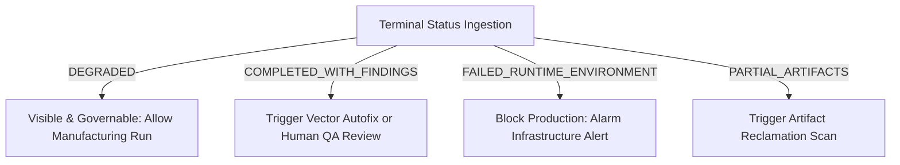

# Preflight Status Contract

The **Preflight Status Contract** defines the canonical state-machine rules, status representations, and lifecycle transitions shared between all layers of the PrintPrice OS platform. 

Aligning all systems (Engine, Service, Worker, BFF, and ControlPlane) to these uniform status definitions ensures consistent processing and reliable automated routing decisions.

Our status lifecycle is governed by the platform's core operational promise:

> **Engine produces truth. Service preserves truth. Worker executes and persists truth. BFF displays truth. ControlPlane governs truth.**

---

## 1. Status Categories

Every preflight job transitions through standardized in-flight, terminal diagnostic, or terminal failure states. The table below represents the canonical taxonomy:

### Terminal Diagnostic Statuses
These states represent successfully completed analyses, even if document validation findings were discovered or if extraction occurred with restricted tools.
*   **`COMPLETED`**: Safe, clean parsing execution with zero preflight errors or warnings.
*   **`SUCCESS` / `SUCCEEDED`**: Synonymous with `COMPLETED` for backward compatibility.
*   **`PASS`**: Mapped directly from print partner gates, confirming the document matches printer profiles.
*   **`PASS_WITH_WARNINGS`**: The document is printable, but contains minor non-critical warnings.
*   **`COMPLETED_WITH_FINDINGS`**: The file was fully inspected and preflight findings were extracted.
*   **`DEGRADED`**: The analysis completed with reduced extraction fidelity or reduced diagnostic coverage. It does not imply mock fallback, and `realExtraction` may remain true.
*   **`PARTIAL`**: Parsing succeeded partially, extracting subset attributes where possible.
*   **`PARTIAL_ARTIFACTS`**: Telemetry reports exist, but certain optional file artifacts could not be generated.

### Terminal Failure Statuses
These states represent fatal, unrecoverable failures that halted diagnostic execution.
*   **`FAILED`**: The parsing engine explicitly aborted due to a corrupted, unreadable, or invalid input file.
*   **`ERROR`**: Synonymous with `FAILED` in legacy service routing context.
*   **`FAILED_RUNTIME_ENVIRONMENT`**: The execution container encountered a fatal infrastructure error (such as a core dump, dependency loader crash, or running out of disk space).
*   **`ENGINE_ENVIRONMENT_FAILURE`**: Synonymous with `FAILED_RUNTIME_ENVIRONMENT` at the CLI engine level.

### In-Flight Statuses
These states represent jobs currently undergoing active queue processing or state validation.
*   **`QUEUED`**: The job has been submitted and is currently waiting in the task queue.
*   **`PROCESSING` / `RUNNING`**: The worker node has locked the task and is currently executing the CLI parser.
*   **`UPLOADING`**: The analysis is complete, and the worker is writing the resulting `report.json` or `fixed.pdf` to object storage.
*   **`VALIDATING`**: The Service is running checksum and security validations on the uploaded outputs.

---

## 2. Meaning of Each Important Status

To prevent ambiguity, every core terminal status is bound to a strict, non-negotiable operational definition:

*   **`COMPLETED`**: A clean run indicating the document successfully conformed to all physical quality gates (bleed limits, CMYK color space, embedded fonts).
*   **`COMPLETED_WITH_FINDINGS`**: Indicates the preflight engine completed a **real, full extraction** of properties, but identified document violations (e.g. 5 errors). This is a successful analysis, **not** an infrastructure or network failure.
*   **`DEGRADED`**: Indicates that the analysis completed with reduced diagnostic coverage or reduced extraction fidelity. It does not imply mock fallback, and `realExtraction` may remain true. Although specialized optional CLI utilities (such as a separate spot-color parser) might be missing from the host, the core parsing builders successfully completed physical extraction. It represents a valid, usable diagnostic result and **must never** be classified as an environment failure.
*   **`PARTIAL`**: Denotes a run that succeeded in extracting page parameters and metadata but encountered coordinate errors on complex vector layers. The extracted parameters are valid and remain highly useful for pricing and partner estimation.
*   **`PARTIAL_ARTIFACTS`**: Mapped when database values are successfully persisted but an API interruption prevents writing specific optional summary files to persistent storage.
*   **`FAILED_RUNTIME_ENVIRONMENT`**: Reserved strictly for absolute toolchain or infrastructure crashes (e.g. Node.js process out of memory, container termination by kernel). This is an infrastructure emergency requiring operator assistance.

---

## 3. Mapping Rules

Every layer must strictly adhere to the following evaluation rules when serializing job records:

1.  **Tool Absence Separation**: The absence of an optional command-line parsing tool alone **must not** map the job to `FAILED_RUNTIME_ENVIRONMENT`. The engine must catch the exit code, mark the `degradedMode` flag, and finish processing.
2.  **Extraction Validity**: If `analysisIntegrity.realExtraction` is `true`, it is mathematically impossible for the status to be `FAILED_RUNTIME_ENVIRONMENT`. The successful extraction of telemetry automatically validates the status as `DEGRADED` or `PARTIAL`.
3.  **Governance Drives**: Downstream automated routing systems must examine the `outcome_category` field (e.g., `DEGRADED_ANALYSIS` vs `FAILED_RUNTIME_ENVIRONMENT`) to determine whether the failure was structural (document error) or infrastructural (system error).
4.  **Terminal Progress Gate**: For all terminal diagnostic statuses (including `DEGRADED` and `PARTIAL`), the `progress` field **must** be set to exactly `100`.

---

## 4. Governance Use

The ControlPlane utilizes these statuses to govern print manufacturing queues and direct system maintenance workflows:



*   **`DEGRADED`**: The ControlPlane marks the job as governable and permits automatic routing. It simultaneously flags the worker container ID for a background rolling environment re-image.
*   **`COMPLETED_WITH_FINDINGS`**: Automatically triggers the automated vector repair pipeline (`ppos-preflight-worker` autofix) or holds the order in queue for a human-in-the-loop manual review.
*   **`FAILED_RUNTIME_ENVIRONMENT`**: Instantly halts all order intake, blocks production routing for the client, and sound-alerts infrastructure teams to address server or container environment failures.
*   **`PARTIAL_ARTIFACTS`**: Triggers a background reclamation job, where the worker re-attempts to sync missing storage files without re-running the heavy CLI parsing cycle.

---

## 5. Status Examples

### Valid `DEGRADED` Payload
The following payload represents a correctly degraded, fully valid terminal diagnostic record:
```json
{
  "status": "DEGRADED",
  "analysis_status": "DEGRADED",
  "outcome_category": "DEGRADED_ANALYSIS",
  "progress": 100,
  "analysisIntegrity": {
    "realExtraction": true,
    "degradedMode": true,
    "fallbackUsed": false
  }
}
```
*   **Why it is valid**: It acknowledges that extraction was degraded due to missing secondary tools (`degradedMode = true`), but certifies that actual document properties were successfully extracted (`realExtraction = true`), terminating with `progress = 100`.

---

### Invalid Anti-Pattern Payload
The following payload represents a critical violation of our decoupled diagnostic contract:
```json
{
  "status": "FAILED_RUNTIME_ENVIRONMENT",
  "missing_tools": ["mutool"],
  "analysisIntegrity": {
    "realExtraction": true
  }
}
```

*   **Why it is invalid**: This payload is highly contradictory and represents an architecture failure:
    1.  It reports `analysisIntegrity.realExtraction = true`, which means the engine successfully read the file and extracted properties.
    2.  Despite succeeding in extracting truth, it incorrectly labels the operational status as a fatal `FAILED_RUNTIME_ENVIRONMENT` simply because an auxiliary CLI tool (`mutool`) was missing from the host.
    3.  Under the Phase 10/35 contract, this job **must** be reported as `DEGRADED` or `PARTIAL` with a successful progress of `100`, keeping the infrastructure queue open.
