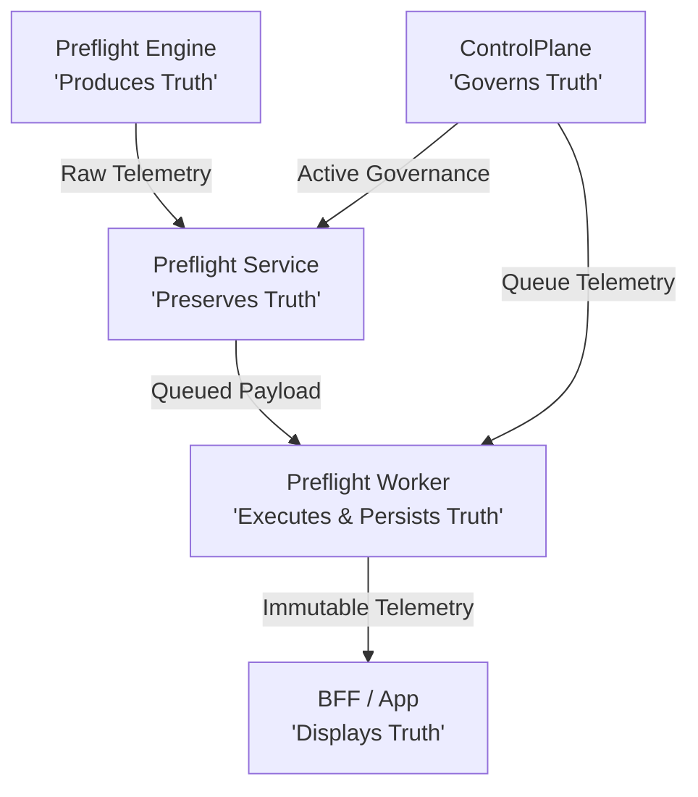

# State of the Art Architecture

PrintPrice OS represents a fundamental paradigm shift in print manufacturing orchestration, moving the industry away from legacy manual estimating calculators toward a fully distributed, deterministic, and multi-layered production intelligence ecosystem.

By combining deterministic document analytics with automated routing heuristics, the platform ensures complete operational reliability from PDF analysis down to the final physical manufacturing step.

---

## The Core Philosophy of Truth

At the heart of the PrintPrice OS architecture is a strict flow of validation and accountability across all system boundaries. Every architectural component has an explicit, decoupled responsibility to guarantee data consistency.

This operational integrity is encapsulated by our canonical truth assertion:

> **Engine produces truth. Service preserves truth. Worker executes and persists truth. BFF displays truth. ControlPlane governs truth.**

---

## Architectural Taxonomy

Traditional print workflow systems suffer from tight coupling, where file parsers, database records, background task loops, and frontend representations are intertwined. PrintPrice OS enforces clear separation:

1. **The Parsing Layer**: Highly isolated, deterministic command-line engines designed to parse and extract metadata without external database dependencies.
2. **The REST/API Layer**: High-throughput gateways designed to validate and persist ingestion schemas without running heavy computation.
3. **The Asynchronous Compute Layer**: Scalable task workers operating on dedicated job queues, running heavy processing scripts, and persisting artifacts to long-term storage.
4. **The BFF / UI Layer**: Dedicated presentation layers pulling direct states and exposing them to operators without mutating business logic.
5. **The Governance Layer**: Administration portals monitoring queue health, executing administrative syncs, and enforcing authentication boundaries.

---

## Production Isolation & Phase Statuses

To maintain absolute system safety, features and metrics are strictly classified into clear stages of maturity.

### 1. Validated in Production (Phase 35.5 Status)
The following capabilities have been fully stress-tested and certified in production:
*   **Five-Layer Diagnostic Flow**: Verification of preflight parsing, database serialization, asynchronous queue execution, and UI telemetry representation.
*   **Graceful Engine Degradation**: The preflight parser isolates external tool failures, degrading to partial extraction modes without failing the execution context.
*   **Security Decoupling**: Isolation of administrative gateway credentials from client-facing API channels.

### 2. Implemented but Active Watchpoint
The following systems are running in production but require close operations monitoring:
*   **Concurrent Autofix Load Limits**: Processing highly complex PDFs through the autofix tool can result in CPU spikes. Active concurrency throttles are placed at 5 simultaneous threads per worker node.
*   **Storage Write Latency**: During peak volumes, writing massive finalized PDFs (`fixed.pdf`) to storage shows higher latency.

### 3. Next Phase (Phase 36 Preview)
The following features are under design and **NOT** yet present in production:
*   **Order Intake File Governance**: Dynamically rejecting order flows before worker ingestion based on preflight contract warnings.
*   **Policy-Enforced Auto-Routing**: Automatic routing rejection of orders violating print network partner constraints.
