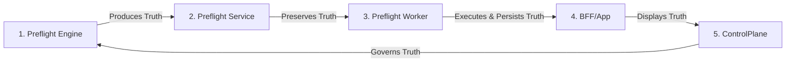

# Phase 35.5 — Preflight Diagnostic Contract Production Freeze

This release document details the formal milestone specifications, validation metrics, and operational guidelines for **Phase 35.5 — Preflight Diagnostic Contract Production Freeze**. 

This release locks the foundational preflight contract and locks data flows across the printing pipeline.

---

```
PHASE 10/35 PREFLIGHT DIAGNOSTIC CONTRACT ALIGNMENT: COMPLETE
STATUS: PRODUCTION VALIDATED
RESULT: READY
BLOCKERS: NONE
```

---

## 1. Milestone Summary

The **Phase 35.5 Production Freeze** marks the completion of our platform's diagnostic alignment objectives. 

Every microservice, command-line utility, database schema, and dashboard component has been verified to conform to uniform data validation contracts. The production environment is validated as robust, stable, and ready to support customer-facing intake gates.

---

## 2. Production Validated Chain

The preflight diagnostic pipeline successfully operates across our isolated microservice boundaries:



*   **Engine produces truth**: Direct binary parsing analyzes layout and bleed structures without fabricating findings.
*   **Service preserves truth**: Registry databases store raw engine JSON traces without destructive semantic loss under validated outcome categories.
*   **Worker executes and persists truth**: Background task processors manage queues, upload file artifacts, and track execution.
*   **BFF displays truth**: Real-time dashboards render exact status badges and progress streams.
*   **ControlPlane governs truth**: Central administration panels check node environments and orchestrate sync sweeps.

---

## 3. Validated Analyze Job

The diagnostic contract was verified using the following production analysis log:

*   **Job Identifier (`jobId`)**: `job_1779116602472_1d246`
*   **Operational Status**: `DEGRADED`
*   **Analysis Status**: `DEGRADED`
*   **Outcome Category**: `DEGRADED_ANALYSIS`
*   **Progress**: `100`
*   **Analysis Integrity**:
    *   `realExtraction`: `true` (Inspected actual document geometry; not mocked)
    *   `degradedMode`: `true` (Gracefully handled missing color tool configuration on the host)
*   **Findings Count**: `5`
*   **Artifact File**: `report.json` (`analysis_report`)

---

## 4. Validated Autofix Job

The automated repair pipeline was verified using the following vector correction trace:

*   **Fix Identifier (`fixId`)**: `fix_1779116602946`
*   **Source Analyze Job ID (`sourceJobId`)**: `job_1779116602472_1d246`
*   **Execution Status**: `COMPLETED`
*   **Repairs Count**: `4`
*   **Applied Repairs Count**: `4` (All 4 layout anomalies successfully repaired)
*   **Skipped Repairs Count**: `0`
*   **Failed Repairs Count**: `0`
*   **Repaired PDF Output**: `fixed.pdf` (`final_fixed_pdf`)

---

## 5. Contract Rules Frozen

All status transitions, error scopes, and parsing rules are frozen for Phase 35.5:
*   **Graceful CLI Degradation**: Missing optional command-line tools must not crash the container or cause `FAILED_RUNTIME_ENVIRONMENT`. The run must terminate as `DEGRADED` with `progress: 100`.
*   **Truthful Telemetry**: Under no circumstances may any component simulate or fabricate preflight findings.
*   **Terminal Progress**: Terminal diagnostic runs (including degraded runs) must report exactly `100` progress to prevent client-side infinite polling loops.

---

## 6. Auth Separation Frozen

Security boundary protocols are locked across all inter-service transactions:
*   **Isolation of Admin Token**: The ControlPlane admin token (`PPOS_CONTROL_TOKEN`) is restricted to `/api/admin/*` and is strictly stripped from downstream service requests.
*   **Inter-Service Auth**: Downstream calls use dedicated, cryptographically signed `PREFLIGHT_JWT` bearer tokens with tenant scopes.

---

## 7. Artifact Contract Frozen

Physical file storage, resolving priority, and error envelopes are locked:
*   **Immutable Storage**: Uploaded files (`report.json`, `fixed.pdf`, `certified.pdf`) are mapped to unique job IDs.
*   **Resolution Rules**: Logical aliases resolve to physical files using a strict priority order: `fixed.pdf` ➔ `normalized.pdf` ➔ `certified.pdf`.
*   **Error Preservation**: The `ARTIFACT_NOT_FOUND` error structure is strictly preserved, and must never be collapsed into generic server errors.

---

## 8. Known Watchpoints

The following items are flagged for engineering observation during this freeze:
*   **Coordinate Compaction**: Documents containing massive coordinates can cause database transport lag. Coordinate compaction heuristics are scheduled for evaluation.
*   **Sync Batches**: Large-scale regional synchronization queries can strain memory buffers. Batching constraints must be monitored.
*   **SSE Resilience**: Browser-side Server-Sent Events (SSE) must have retry safeguards if internet connections drop.

---

## 9. Next Phase: Phase 36 — Production Order Intake & File Governance

:::note
**DEVELOPMENT BLUEPRINT**: The upcoming Phase 36 modules are under design and are **not** part of the active frozen production deployment. Phase 36 starts after the Phase 35.5 production freeze.
:::

With the stabilization of our diagnostic contracts complete, the platform is positioned to execute **Phase 36: Production Order Intake & File Governance**. Phase 36 will bind marketplace selected offers directly to final PDF uploads, compute order readiness using preflight status, gate invoicing, and prepare standardized metadata handoffs for printhouses.

---

## 10. Last Production Validation Telemetry

The last active inter-service execution has been verified in production and logged under the following records:

### Validated Analyze Job
*   **Job ID (`jobId`)**: `job_1779116602472_1d246`
*   **Operational Status**: `DEGRADED`
*   **Outcome Category**: `DEGRADED_ANALYSIS`
*   **Progress**: `100`
*   **Analysis Integrity**: `realExtraction = true`, `degradedMode = true`, `fallbackUsed = false`
*   **Findings Count**: `5`
*   **Artifact**: `report.json` (`analysis_report`)

### Validated Autofix Job
*   **Fix ID (`fixId`)**: `fix_1779116602946`
*   **Source Job ID (`sourceJobId`)**: `job_1779116602472_1d246`
*   **Operational Status**: `COMPLETED`
*   **Repairs Count**: `4`
*   **Applied Count**: `4`
*   **Skipped Count**: `0`
*   **Failed Count**: `0`
*   **Repaired PDF Output**: `fixed.pdf` (`final_fixed_pdf`)
