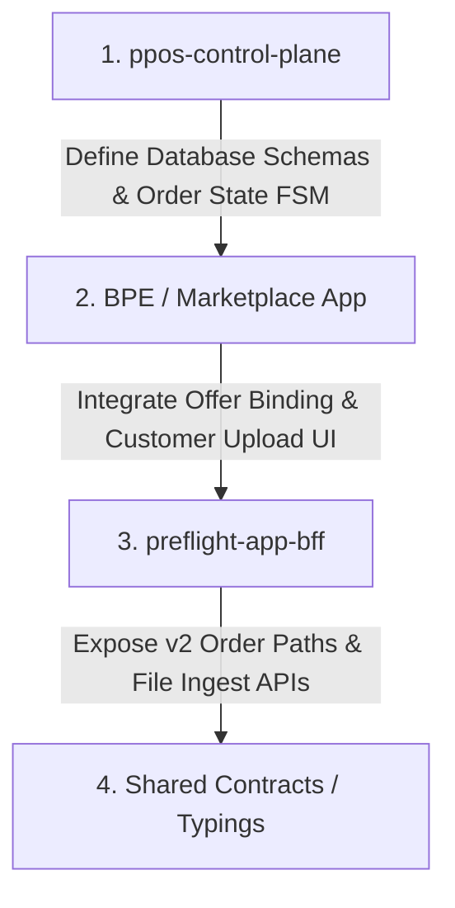

# Phase 36 — Production Order Intake & File Governance

This document presents the future architectural blueprint and operational roadmap for **Phase 36: Production Order Intake & File Governance**. 

Following the successful validation and freeze of the Phase 10/35 Preflight Diagnostic Contract, Phase 36 transitions the platform from standalone document testing to a fully integrated marketplace order fulfillment pipeline.

Our processing flow is governed by the platform's core operational promise:

> **Engine produces truth. Service preserves truth. Worker executes and persists truth. BFF displays truth. ControlPlane governs truth.**

---

## 1. Objective

The core objective of Phase 36 is to build a robust, quality-gated transaction path that securely transitions a customer from an initial price estimation to physical print readiness:

---

## 2. Scope

The implementation scope of Phase 36 includes the following developmental blocks:

*   **Marketplace Order Creation**: Converting estimation requests into structured marketplace transaction records.
*   **Selected Offer Binding**: Locking the customer's selected printing offer (price, transit time, and partner printhouse ID) to the main order database record.
*   **Final Print File Ingestion**: Establishing secure uploads for heavy production assets:
    *   `INTERIOR_PDF`: The inner book blocks and page spreads.
    *   `COVER_PDF`: Cover layouts including spine width, front cover, back cover, and flaps.
*   **File Versioning Controls**: Supporting multiple document uploads per order, preserving complete trace history for auditing.
*   **Checksum & Storage Verification**: Locking uploaded files with cryptographical SHA-256 metadata directly inside object storage registries.
*   **Preflight Job Binding**: Automatically triggering preflight worker diagnostics upon upload completion and linking results to the order.
*   **Order Readiness Computation**: Dynamic rules evaluation confirming document checks, partner checks, and tenant details.
*   **Invoice Gating**: Automatically preventing invoice generation until quality gates are satisfied.
*   **Printhouse Handoff Preparation**: Packaging metadata, physical download links, and order requirements for partner transmission.

---

## 3. Not in Scope Yet

To maintain extreme development focus and protect release stability, the following capabilities are **explicitly excluded** from Phase 36 and reserved for subsequent sprints:

*   **Full MES Dispatch**: Direct physical machine-level scheduling or print-line queue optimization.
*   **Machine-Level Routing**: Automated job dispatching to specific print presses or binding lines inside the print partner shops.
*   **Payment Splits / Wallet Routing**: Automated processing of financial splits, sub-merchant transfers, or multi-party wallet payouts.
*   **Advanced AI Optimization**: Automated AI page rearrangement, print imposition, or document modifications beyond standard preflight autofixes.
*   **New Engine Diagnostics**: Core updates to the low-level parsing engine's structural properties extraction rules.

---

## 4. Proposed Order States

Marketplace orders will transition through a standardized state machine:

*   **`DRAFT`**: The order is created but has not been finalized or bound to a selected offer.
*   **`OFFER_SELECTED`**: The customer has committed to a specific print offer and price.
*   **`FILES_REQUIRED`**: The order is active, and the customer must upload physical PDF files.
*   **`FILES_UPLOADED`**: All required production PDFs have been written to object storage.
*   **`PREFLIGHT_PENDING`**: The files are currently queued for asynchronous analysis.
*   **`PREFLIGHT_PASSED`**: The files successfully satisfied all structural preflight requirements.
*   **`PREFLIGHT_DEGRADED`**: The files passed preflight checks under degraded execution rules.
*   **`PREFLIGHT_BLOCKED`**: Preflight identified critical document errors that block production.
*   **`READY_TO_INVOICE`**: All quality gates are satisfied, and the order is cleared for invoicing.
*   **`INVOICED`**: The invoice has been compiled and dispatched to the customer.
*   **`PAID`**: Payment verification has completed.
*   **`HANDOFF_READY`**: Metadata packages and files are verified and prepared for printhouse transmission.
*   **`SENT_TO_PRINTHOUSE`**: The order payload has been accepted by the print partner's intake gateway.

---

## 5. File Roles

To ensure correct preflight profiling, physical files must be uploaded under one of three distinct roles:

1.  **`INTERIOR_PDF`**: Mapped to book page blocks, checked for font embedding, page count alignment, and CMYK color spaces.
2.  **`COVER_PDF`**: Mapped to cover plates, checked for spine width calculations, bleed boundaries, and crop coordinates.
3.  **`OPTIONAL_ASSETS`**: Mapped to supplementary materials (insertions, bookmarks, shipping tags), which undergo light integrity validation only.

---

## 6. File States

Every uploaded file will hold an individual processing state in the file registry database:

*   **`UPLOADED`**: The file has been successfully written to object storage.
*   **`VALIDATING`**: Running initial malware and format-validity audits on the asset.
*   **`PREFLIGHT_RUNNING`**: The file is undergoing active processing inside a worker container.
*   **`ACCEPTED`**: Checked and cleared by the parser.
*   **`ACCEPTED_WITH_WARNINGS`**: Cleared for print, but minor warnings exist.
*   **`REQUIRES_FIX`**: Preflight failed, but errors can be corrected via automated autofix tools.
*   **`REJECTED`**: Preflight failed due to unrecoverable document errors.
*   **`SUPERSEDED`**: A newer version of the file has been uploaded by the customer, archiving this version.

---

## 7. Governance Rules

The ControlPlane enforces these rules to govern the transition of orders into production:

*   **Degraded Permissibility**: A `PREFLIGHT_DEGRADED` result **does not** automatically block order progression. If the core physical geometry is verified, the order can proceed.
*   **Infrastructure Fault Blocking**: A `FAILED_RUNTIME_ENVIRONMENT` status blocks the order but automatically triggers an infrastructure retry thread on a separate worker node.
*   **Document Fault Gating**: A critical PDF document failure (`REJECTED`) halts order progression, flags the order, and routes it to the customer for a new upload or to a human administrator for review.
*   **Incomplete Upload Blocking**: Missing a mandatory file role (`INTERIOR_PDF` or `COVER_PDF`) strictly blocks invoice generation.
*   **Invoice Cleared Gate**: An invoice can only be generated when all required physical files are marked `ACCEPTED`/`ACCEPTED_WITH_WARNINGS` and the customer, selected offer, and printhouse IDs are verified.

---

## 8. Suggested Repository Implementation Order

To ensure clean database schema integrations, development will proceed in the following order:

1.  **`ppos-control-plane`**: Draft database migration schemas (order registries, file tracking tables, FSM triggers) and construct basic dashboard governance lists.
2.  **`BPE / Marketplace App`**: Build frontend customer portals for selecting offers, triggering orders, and displaying physical file drag-and-drop zones.
3.  **`preflight-app-bff`**: Expose core endpoint pathways (`/api/v2/orders/*`, `/api/v2/files/*`) to broker secure S3 uploads and stream processing statuses.
4.  **`Shared Contracts`**: Define typings and types packages shared across services.
