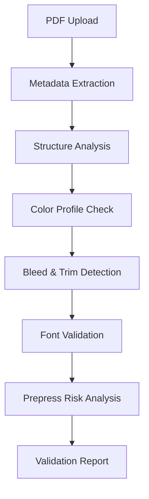

# Preflight Processing Pipeline

```mermaid
flowchart TD

UPLOAD[PDF Upload]

META[Metadata Extraction]
STRUCT[Structure Analysis]
COLOR[Color Profile Check]
BLEED[Bleed & Trim Detection]
FONT[Font Validation]

RISK[Prepress Risk Analysis]

REPORT[Validation Report]

UPLOAD --> META
META --> STRUCT
STRUCT --> COLOR
COLOR --> BLEED
BLEED --> FONT

FONT --> RISK
RISK --> REPORT

```

